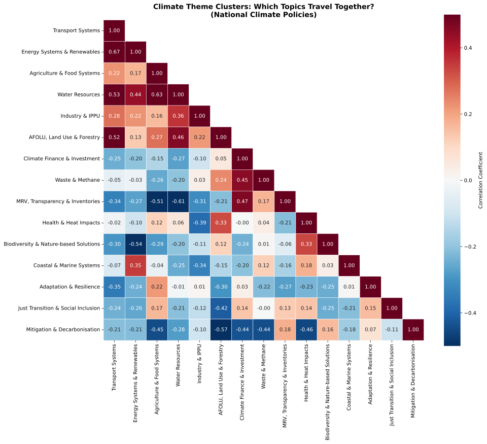
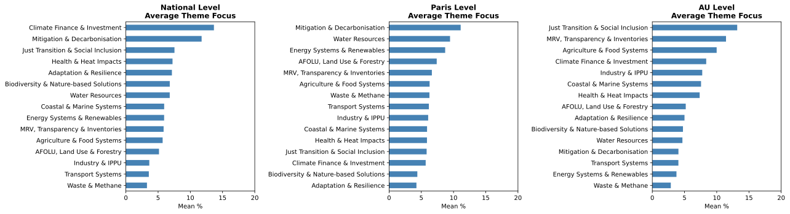
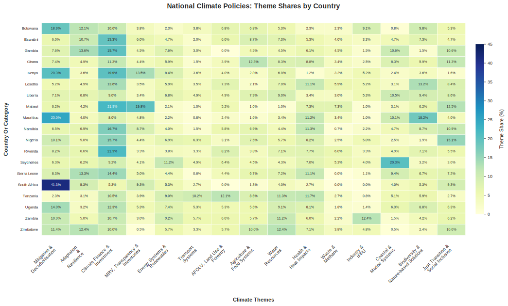
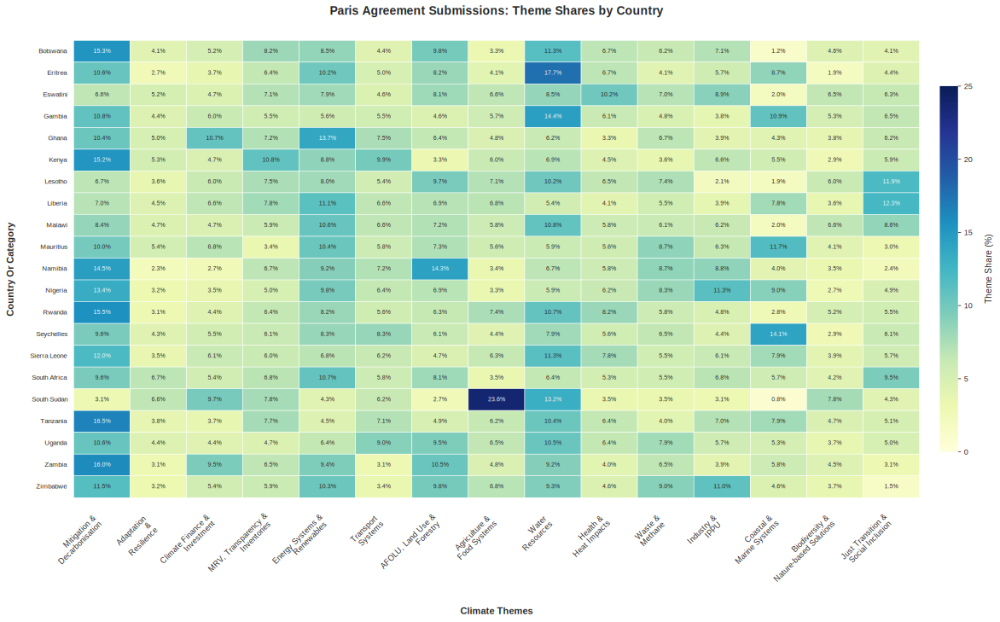
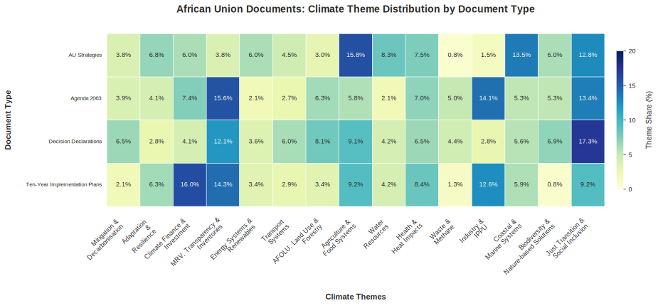

# Climate Policy Theme Analysis in Africa

<a target="_blank" href="https://cookiecutter-data-science.drivendata.org/">
    
</a>


A Corpus-Based NLP Framework for Thematic Analysis of English Climate Documents and Policies in Africa.

## 📊 Project Overview
This repository analyzes the distribution of 15 climate policy themes across three governance levels in Africa:
- **National Climate Policies** (African countries)
- **UNFCCC/Paris Agreement Submissions**  
- **African Union Documents**

## 🔍 Key Findings
- **Themes are empirically distinct** - Maximum correlation between themes is only 0.67, confirming all 15 categories measure unique policy dimensions
- **Governance level matters** - Different policy frameworks prioritize different themes (see visualizations below)
- **Natural policy clusters** emerged from correlation analysis, showing how themes tend to co-occur

## 📈 Visualizations

### Theme Correlation Clusters


### Governance Level Comparison


### Policy Heatmaps
| National Policies | Paris Agreement | AU Documents |
|-------------------|-----------------|--------------|
|  |  |  |

## 🚀 Getting Started

### Prerequisites
- Python 3.8+
- pip

### Installation
```bash
# Clone the repository
git clone https://github.com/YOUR_USERNAME/MIT808_Capstone.git
cd MIT808_Capstone

# Create and activate virtual environment
python -m venv venv
source venv/bin/activate  # On Windows: venv\Scripts\activate

# Install dependencies
pip install -e .

# 1. Export Excel sheets to CSV
python notebooks/01_export_excel_sheets.py

# 2. Generate heatmaps
python notebooks/02_generate_heatmaps.py

# 3. Run correlation analysis
python notebooks/03_theme_correlation_analysis.py

Project Structure
├── data
│   └── processed/          <- Cleaned CSV files
├── notebooks/               <- Analysis scripts (numbered order)
├── reports/figures/         <- Generated visualizations
├── Data_Analysis/           <- Source code
│   └── config.py            <- Theme definitions
└── requirements.txt         <- Dependencies